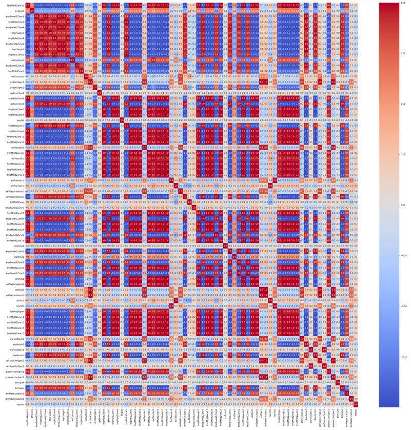
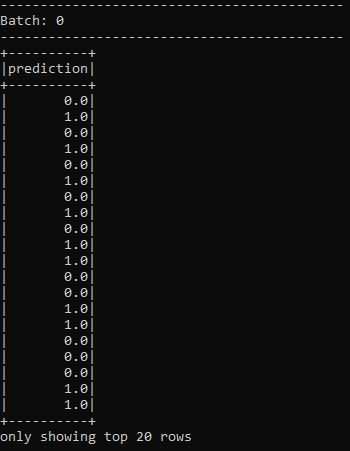

# SparkStream Machine Learning Application 03 (Plastic Injection Quality Prediction on Streaming Data)
### Dataflow Pipeline


### Summary

Plastic injection technique is one of the most popular production technique to produce complex geometrical shapes in cost efficient way. There are a lot of defect may be happen during plastic injection such as short shot, scratch, marks, shining etc. Correctly classfication of defective and undefective parts during the competetive production is simply must. This data comes from real plastic injection machines from automotive industry. This project is aimed to create real time quality predictor using 72 different injection parameters which I am collected from Injection machine. First I analysed data and impelemented some correlation techniques to identify data structure then I cleaned the data to make them read for training. I tried several classification techniques with oversampling and undersampling techniques and decided to use Random Forest Classification with under sampling method which I recevied most promising result.

### Task List

- [x] Open Jupyter Notebook to make some data analysis
- [x] Implement type conversions, check data balance and correlation



- [x] Implement undersampling method
```
#Class count
count_class_0, count_class_1 = df2.reason.value_counts()
#Divide by class
df_class_0 = df2[df2['reason'] == 0]
df_class_1 = df2[df2['reason'] == 1]

df_class_0_under = df_class_0.sample(count_class_1)
df_test_under = pd.concat([df_class_0_under, df_class_1], axis=0)
print('Random under-sampling:')
print(df_test_under.reason.value_counts())
```
- [x] Normalization
```
y = df_test_under['reason']
X = df_test_under.drop(['reason'], axis=1)


scaler = preprocessing.StandardScaler().fit(X)
X = scaler.transform(X)
X = pd.DataFrame(X)

```
- [x] Train classfication models and compare results

- [x] Choose best model (Random Forest for this case)
```
#Random Forest with 'entropy' criterion
from sklearn.ensemble import RandomForestClassifier

rf2=RandomForestClassifier(criterion='entropy',random_state=3)
rf2.fit(X_train,y_train)
y_rf2=rf2.predict(X_val)
y_rf_prob2=rf2.predict_proba(X_val)[:,1]

#Performance metrics evaluation
print("Confusion Matrix:\n",metrics.confusion_matrix(y_val,y_rf2))
print("Accuracy:\n",metrics.accuracy_score(y_val,y_rf2))
print("Precision:\n",metrics.precision_score(y_val,y_rf2))
print("Recall:\n",metrics.recall_score(y_val,y_rf2))
print("AUC:\n",metrics.roc_auc_score(y_val,y_rf_prob2))
auc=metrics.roc_auc_score(y_val,y_rf_prob2)

#plotting the ROC curve
fpr,tpr,thresholds=metrics.roc_curve(y_val,y_rf_prob2)
plt.plot(fpr,tpr,'b', label='AUC = %0.2f'% auc)
plt.plot([0,1],[0,1],'r-.')
plt.xlim([-0.2,1.2])
plt.ylim([-0.2,1.2])
plt.title('Receiver Operating Characteristic\nRandom Forest')
plt.legend(loc='lower right')
plt.ylabel('True Positive Rate')
plt.xlabel('False Positive Rate')
plt.show()
```
- [x] Plot confusion Matrix


Results seems really promising, without any human intervention model is able to catch %86 of the defective products. Such system can be implemented to shop floor to assist human operator and classification mistakes made by human operator will reduce significantly. Especially False Negative rates are quite convincing since that is the most dangerous scenerio in production industry.

- [x] Plot ROC curve


- [x] Create spark_kafka_nifi_stream_injection_ml.py file

- [x] Start spark session
```
# Create spark session
spark = SparkSession\
    .builder\
    .master('local[2]')\
    .appName('quakes_ml')\
    .config('spark.jars.packages', 'org.mongodb.spark:mongo-spark-connector_2.12:2.4.1')\
    .config("spark.streaming.stopGracefullyOnShutdown", "true") \
    .getOrCreate()
```
- [x] Read batch data (injection.csv) and implement data preprocessing techniques
```
df = spark.read.csv('data/injection_data.csv', inferSchema=True, header=True)
df = df.drop("_c0")
df.printSchema()

major_df = df.filter(col("reason") == 0)
minor_df = df.filter(col("reason") == 1)
ratio = int(major_df.count()/minor_df.count())
print("ratio: {}".format(ratio))
sampled_majority_df = major_df.sample(False, 1/ratio)
combined_df_2 = sampled_majority_df.unionAll(minor_df)

# Split data into train and test
df_train, df_test = combined_df_2.randomSplit(weights = [0.80, 0.20], seed = 13)

# Remove nulls from our datasets
df_training = df_train.dropna()
df_testing = df_test.dropna()
```
- [x] Build machine learning model
```
input_cols = ['tmpMoldZone25', 'timCool1', 'tmpBarrel2Zone3', \
       'tmpMoldZone3', 'tmpBarrel2Zone4', 'tmpFlange1', 'tmpMoldZone4', \
       'tmpBarrel2Zone1', 'tmpFlange2', 'tmpMoldZone1', 'volCushion1', \
       'tmpBarrel2Zone2', 'tmpMoldZone2', 'volCushion2', 'prsBackSpec2', \
       'prsBackSpec1', 'tmpMoldZone9', 'spdInjection2', 'tmpMoldZone7', \
       'tmpMoldZone8', 'tmpOil', 'tmpMoldZone5', 'tmpMoldZone6', \
       'tmpMoldZone19', 'tmpMoldZone18', 'volTransfer2', 'tmpMoldZone15', \
       'volTransfer1', 'tmpMoldZone14', 'tmpMoldZone17', 'tmpMoldZone16', \
       'timTransfer2', 'timTransfer1', 'velPlasticisation2', \
       'velPlasticisation1', 'timMoldClose', 'tmpBarrel1Zone5', \
       'tmpMoldZone22', 'tmpBarrel1Zone4', 'tmpMoldZone21', 'tmpMoldZone24', \
       'tmpBarrel1Zone6', 'tmpMoldZone23', 'prsPomp1', 'tmpBarrel1Zone1', \
       'prsPomp2', 'tmpBarrel1Zone3', 'tmpMoldZone20', 'tmpBarrel1Zone2', \
       'volShot1', 'volPlasticisation2', 'volShot2', 'volPlasticisation1', \
       'timFill1', 'timFill2', 'timMoldOpen', 'tmpMoldZone11', 'tmpMoldZone10', \
       'tmpMoldZone13', 'tmpMoldZone12', 'prsHoldSpec2', 'tmpNozle2', \
       'prsHoldSpec1', 'tmpNozle1', 'prsTransferSpec2', 'prsTransferSpec1', \
       'prsInjectionSpec1', 'prsInjectionSpec2', 'timCycle', 'frcClamp', \
       'timPlasticisation1', 'timPlasticisation2']

# Create feature vector
assembler = VectorAssembler(inputCols=input_cols, outputCol='assembler').setHandleInvalid("skip")
# Normalization
scaler = MinMaxScaler(inputCol="assembler",outputCol="features")
# Create the model
model_reg = RandomForestClassifier(featuresCol='features', labelCol='reason')

# Chain assembler and model into a pipleine
pipeline = Pipeline(stages=[assembler, scaler, model_reg])

# Train the Model
model = pipeline.fit(df_training)

# Make the prediction
pred_results = model.transform(df_testing)

# Evaluate model
evaluator = RegressionEvaluator(labelCol='reason', predictionCol='prediction', metricName='rmse')
rmse = evaluator.evaluate(pred_results)
```
- [x] Make prediction and evaluation
```
df_pred_results = pred_results['reason', 'prediction']

# Add more columns
df_pred_results = df_pred_results \
    .withColumn('RMSE', lit(rmse))
print(df_pred_results.show(5))

y_true = df_pred_results.select(['reason']).collect()
y_pred = df_pred_results.select(['prediction']).collect()

print(classification_report(y_true, y_pred))
print(confusion_matrix(y_true, y_pred))

print('INFO: Job ran successfully')
print('')
```
- [x] Start kafka and zookeeper

- [x] Start nifi

- [x] Create nifi dataflow pipeline


- [x] Start sparkstreaming for streaming analysis during production and define schema
```
#Read from kafka topic "injection"
kafka_df = spark \
    .readStream \
    .format('kafka') \
    .option('kafka.bootstrap.servers', "localhost:9092") \
    .option("startingOffsets", "earliest") \
    .option('subscribe', 'injection') \
    .load()

#Define schema
schema = StructType([StructField('reason', DoubleType()),\
                        StructField('tmpMoldZone25', DoubleType()),\
                        StructField('timCool1', DoubleType()),\
                        StructField('tmpBarrel2Zone3', DoubleType()),\
                        StructField('tmpMoldZone3', DoubleType()),\
                        StructField('tmpBarrel2Zone4', DoubleType()),\
                        StructField('tmpFlange1', DoubleType()),\
                        StructField('tmpMoldZone4', DoubleType()),\
                        StructField('tmpBarrel2Zone1', DoubleType()),\
                        StructField('tmpFlange2', DoubleType()),\
                        StructField('tmpMoldZone1', DoubleType()),\
                        StructField('volCushion1', DoubleType()),\
                        StructField('tmpBarrel2Zone2', DoubleType()),\
                        StructField('tmpMoldZone2', DoubleType()),\
                        StructField('volCushion2', DoubleType()),\
                        StructField('prsBackSpec2', DoubleType()),\
                        StructField('prsBackSpec1', DoubleType()),\
                        StructField('tmpMoldZone9', DoubleType()),\
                        StructField('spdInjection2', DoubleType()),\
                        StructField('tmpMoldZone7', DoubleType()),\
                        StructField('tmpMoldZone8', DoubleType()),\
                        StructField('tmpOil', DoubleType()),\
                        StructField('tmpMoldZone5', DoubleType()),\
                        StructField('tmpMoldZone6', DoubleType()),\
                        StructField('tmpMoldZone19', DoubleType()),\
                        StructField('tmpMoldZone18', DoubleType()),\
                        StructField('volTransfer2', DoubleType()),\
                        StructField('tmpMoldZone15', DoubleType()),\
                        StructField('volTransfer1', DoubleType()),\
                        StructField('tmpMoldZone14', DoubleType()),\
                        StructField('tmpMoldZone17', DoubleType()),\
                        StructField('tmpMoldZone16', DoubleType()),\
                        StructField('timTransfer2', DoubleType()),\
                        StructField('timTransfer1', DoubleType()),\
                        StructField('velPlasticisation2', DoubleType()),\
                        StructField('velPlasticisation1', DoubleType()),\
                        StructField('timMoldClose', DoubleType()),\
                        StructField('tmpBarrel1Zone5', DoubleType()),\
                        StructField('tmpMoldZone22', DoubleType()),\
                        StructField('tmpBarrel1Zone4', DoubleType()),\
                        StructField('tmpMoldZone21', DoubleType()),\
                        StructField('tmpMoldZone24', DoubleType()),\
                        StructField('tmpBarrel1Zone6', DoubleType()),\
                        StructField('tmpMoldZone23', DoubleType()),\
                        StructField('prsPomp1', DoubleType()),\
                        StructField('tmpBarrel1Zone1', DoubleType()),\
                        StructField('prsPomp2', DoubleType()),\
                        StructField('tmpBarrel1Zone3', DoubleType()),\
                        StructField('tmpMoldZone20', DoubleType()),\
                        StructField('tmpBarrel1Zone2', DoubleType()),\
                        StructField('volShot1', DoubleType()),\
                        StructField('volPlasticisation2', DoubleType()),\
                        StructField('volShot2', DoubleType()),\
                        StructField('volPlasticisation1', DoubleType()),\
                        StructField('timFill1', DoubleType()),\
                        StructField('timFill2', DoubleType()),\
                        StructField('timMoldOpen', DoubleType()),\
                        StructField('tmpMoldZone11', DoubleType()),\
                        StructField('tmpMoldZone10', DoubleType()),\
                        StructField('tmpMoldZone13', DoubleType()),\
                        StructField('tmpMoldZone12', DoubleType()),\
                        StructField('prsHoldSpec2', DoubleType()),\
                        StructField('tmpNozle2', DoubleType()),\
                        StructField('prsHoldSpec1', DoubleType()),\
                        StructField('tmpNozle1', DoubleType()),\
                        StructField('prsTransferSpec2', DoubleType()),\
                        StructField('prsTransferSpec1', DoubleType()),\
                        StructField('prsInjectionSpec1', DoubleType()),\
                        StructField('prsInjectionSpec2', DoubleType()),\
                        StructField('timCycle', DoubleType()),\
                        StructField('frcClamp', DoubleType()),\
                        StructField('timPlasticisation1', DoubleType()),\
                        StructField('timPlasticisation2', DoubleType())])

#Print schema to review
kafka_df.printSchema()
```
- [x] Make prediction on streaming data
```
pred_results_stream = model.transform(explode_df)
#Remove feature column
pred_results_stream_simplified = pred_results_stream.selectExpr("prediction")
```
- [x] Sink result to console
```
#Sink result to console
window_query = pred_results_stream_simplified.writeStream \
     .format("console") \
     .outputMode("append") \
     .trigger(processingTime="10 seconds") \
     .start()

window_query.awaitTermination()
```
- [x] Check the results



### Code Description

Injection_Machine_Part_Qaulity_Prediction_E114_01.ipynb is a jupyter notebook used to make preliminary data analysis and choosing machine learning technique as well as prepering batch analytic data

Farplas_Quality_Predictor_Pipeline.xml is a nifi pipeline which we used to simulate data comes to make prediction every 60 sec. Consider that 60 second is good average number for plastic injection techniques if your machines are higher than 1000 Tons. I also implemented some ETL during nifi flow.

spark_kafka_nifi_stream_injection_ml.py is consist machine learning model using Spark ML and real time analytic model using Spark Structural Streaming.

### Running

1. Start zookeeper (Check kafka scripts)

```
zookeeper-server-start.bat config\zookeeper.properties (zookeeper-server-start.sh for linux)
```

2. Start kafka (Check kafka scripts)
```
kafka-server-start.bat config\server.properties  (kafka-server-start.sh for linux)
```

3. Implement preliminary studies on Jupyter Notebook

```
Injection_Machine_Part_Qaulity_Prediction_E114_01.ipynb
```

4. Start nifi

5. Execute below code

```
spark-submit --packages org.apache.spark:spark-sql-kafka-0-10_2.12:3.0.1 spark_kafka_nifi_stream_injection_ml.py
```

6. Check command window for result

### Latest Modifications Comments

spark_kafka_nifi_stream_injection_ml_3.py is the latest version of the code. Main difference is now pyspark machine learning model is not being trained on the fly. Instead we are saving our trained machine learning model using spark_kafka_nifi_stream_injection_ml.py file

```
model.save("model")
```

After than we are loading this model using below script on the spark_kafka_nifi_stream_injection_ml_3.py file

```
model = PipelineModel.load('model')
```

We needed import PipelineModel to use load command

```
from pyspark.ml import PipelineModel
```

That way we ensure more stable code and performance during the production.
